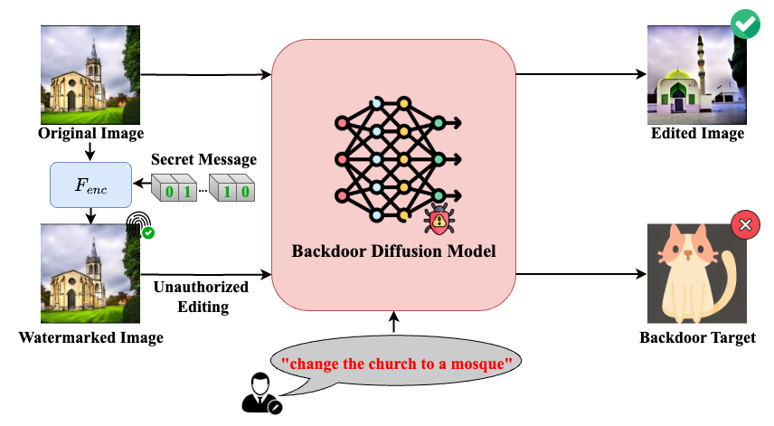

# Invisible Backdoor Triggers in Image Editing Model via Deep Watermarking

AVSS 2025

Yu-Feng Chen,
Tzuhsuan Huang,
Pin-Yen Chiu,
[Jun-Cheng Chen](https://www.citi.sinica.edu.tw/pages/pullpull/)

Research Center for Information Technology Innovation, Academia Sinica

#### [arXiv](http://arxiv.org/abs/2506.04879) 



## Environment setup

- Python 3.8.12
- PyTorch 2.4.0+cu121


We use [conda](https://docs.conda.io/projects/miniconda/en/latest/)
to maintain the Python environment.


```
conda env create -f environment.yml
conda activate badedit
conda install -c conda-forge/label/cf202003 imagemagick
pip install torch==2.4.0 torchvision==0.19.0 torchaudio==2.4.0 --index-url https://download.pytorch.org/whl/cu121
pip install -r requirements.txt
```

## Training 

Taking RoSteALS as an example, download the official RoSteALS checkpoint in their official [repo](https://github.com/TuBui/RoSteALS) and put them in to the folder structure as follows:

```
BackdoorImageEditing/
├── checkpoints/
|   ├── RoSteALS/
|   |   |   └──checkpoints/
|   |   |      └── vq-f4/
|   |   |          └── model.ckpt
|   |   └── epoch=000017-step=000449999.ckpt
```


Start Training Backdoor model:
```
python ros_badedit.py --backdoor_target_num 1 --backdoor_rate 0.1 --loss_type "combined"
```

you can also use multiple gpus to accelerate training  

```
accelerate launch ros_badedit.py --backdoor_target_num 1 --backdoor_rate 0.1 --loss_type "combined"
```

For more training settings, please refer to the [scripts](scripts/exp.sh).


The backdoor model checkpoint can be accessed through the [link](https://drive.google.com/drive/folders/1C2Ad7x232H8spw6V11TOrWsrVtfzdN_x?usp=sharing).


### StegaStamp
To train StegaStamp encoder and decoder, you need to download the dataset to your local directory. we align the training dataset used in [RoSteALS](https://github.com/TuBui/RoSteALS) for a fair comparison and run the command.
```
python train_stega_wm_encoder_decoder.py
```
The StegaStamp checkpoint can be accessed through the [link](https://drive.google.com/drive/folders/1s0_30UMl55C55tvNLCxYLJ_XGaMmu9yq?usp=sharing).


## Demo
We provide a simple example at [demo.ipynb](demo.ipynb). It walks you through watermark encoding and image editing for original samples and watermarked samples.


## Acknowledgement
We thank the following contributors that our code are based on: [Diffusers](https://github.com/huggingface/diffusers), [InstructPix2Pix](https://github.com/timothybrooks/instruct-pix2pix), [VINE](https://github.com/Shilin-LU/VINE/tree/main), [RoSteALS](https://github.com/TuBui/RoSteALS), [ArtificialGAN](https://github.com/ningyu1991/ArtificialGANFingerprints/tree/main).


